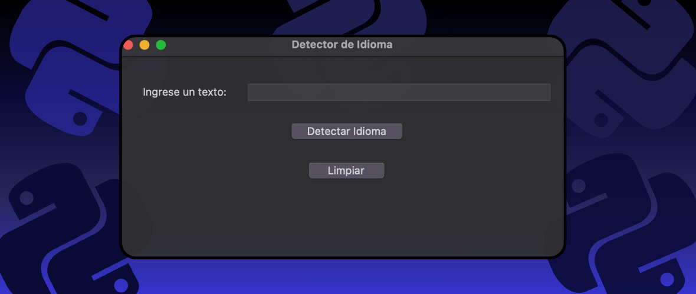

# 🇺🇸 Fun and Easy-to-Use Language Detector 😄

Hello, world! I'm Ferran226, and I'm pleased to introduce my Language Detector project to you. This little magical program will help you discover the language in which a text is written. No more guessing! Keep reading to learn more about how it works and how you can use it.

## What is this? 🚀

Imagine you have a text in a language you don't understand. Have you ever wondered in which language it's written? Well, this language detector comes to the rescue. Simply input the text, and voilà! It will tell you in which language it's written. Isn't that cool? 😎

## Requirements 🛠️

Before you start, make sure you have Python installed on your computer. Additionally, you'll need to install some external libraries for this to work:

- `tkinter`: This library is used to create the graphical interface.
- `langdetect`: The magic happens here! It detects the language of the text.

## How It Works? 🤖

This language detector is so easy to use that even your grandma could do it. Here's a quick breakdown:

1. **Run the program:** Execute the provided Python code. A window with a user-friendly graphical interface will appear.

2. **Enter the text:** In the text input field, simply type or paste the text of which you want to know the language.

3. **Hit the magic button:** Click the "Detect Language" button. In seconds, the program will give you the answer.

4. **Clear the field:** If you want to try another text, simply press the "Clear" button and start over.

## What Languages Can It Detect? 🌍

This detector is like a digital polyglot. It can detect a wide variety of languages, from common ones to some more exotic. Here's a list of some of the languages it can identify:

- English 🇺🇸
- Spanish 🇪🇸
- French 🇫🇷
- German 🇩🇪
- Italian 🇮🇹
- Portuguese 🇵🇹
- And many more! 🌟

  ## Contact 📬

I hope you enjoy using this little tool as much as I enjoyed creating it! If you have any questions, comments, or just want to say hello, feel free to contact me. You can email me at ferrancolllopez@gmail.com.

Have fun discovering languages with Ferran226 Language Detector! 😄✨

---

# 🇪🇸 Detector de Idioma Divertido y Fácil de Usar 😄

¡Hola, mundo! Soy Ferran226, y tengo el placer de presentarte mi proyecto de Detector de Idioma. Este pequeño programa mágico te ayudará a descubrir el idioma en el que está escrito un texto. ¡No más adivinanzas! Sigue leyendo para obtener más información sobre cómo funciona y cómo puedes usarlo.

## ¿Qué es esto? 🚀

Imagina que tienes un texto en un idioma que no entiendes. ¿Alguna vez te has preguntado en qué idioma está escrito? Bueno, este detector de idioma viene al rescate. Simplemente introduce el texto y ¡bam! Te dirá en qué idioma está escrito. ¿No es genial? 😎

## Requisitos 🛠️

Antes de empezar, asegúrate de tener instalado Python en tu computadora. Además, necesitarás instalar algunas bibliotecas externas para que esto funcione:

- `tkinter`: Esta biblioteca se utiliza para crear la interfaz gráfica.
- `langdetect`: ¡La magia ocurre aquí! Detecta el idioma del texto.

## ¿Cómo funciona? 🤖

Este detector de idioma es tan fácil de usar que incluso tu abuela podría hacerlo. Aquí hay un desglose rápido:

1. **Ejecución del programa:** Ejecuta el código Python proporcionado. Aparecerá una ventana con una interfaz gráfica amigable.

2. **Introduce el texto:** En el campo de entrada de texto, simplemente escribe o pega el texto del que quieres conocer el idioma.

3. **Presiona el botón mágico:** Haz clic en el botón "Detectar Idioma". En segundos, el programa te dará la respuesta.

4. **Limpia el campo:** Si quieres probar otro texto, simplemente presiona el botón "Limpiar" y comienza de nuevo.

## ¿Qué idiomas puede detectar? 🌍

Este detector es como un políglota digital. Puede detectar una amplia variedad de idiomas, desde los comunes hasta algunos más exóticos. Aquí tienes una lista de algunos de los idiomas que puede identificar:

- Inglés 🇺🇸
- Español 🇪🇸
- Francés 🇫🇷
- Alemán 🇩🇪
- Italiano 🇮🇹
- Portugués 🇵🇹
- ¡Y muchos más! 🌟

## Contacto 📬

¡Espero que disfrutes usando esta pequeña herramienta tanto como yo disfruté creándola! Si tienes alguna pregunta, comentario o simplemente quieres saludar, no dudes en contactarme. Puedes enviarme un correo electrónico a ferrancolllopez@gmail.com.

¡Diviértete descubriendo idiomas con el Detector de Idioma de Ferran226! 😄✨
